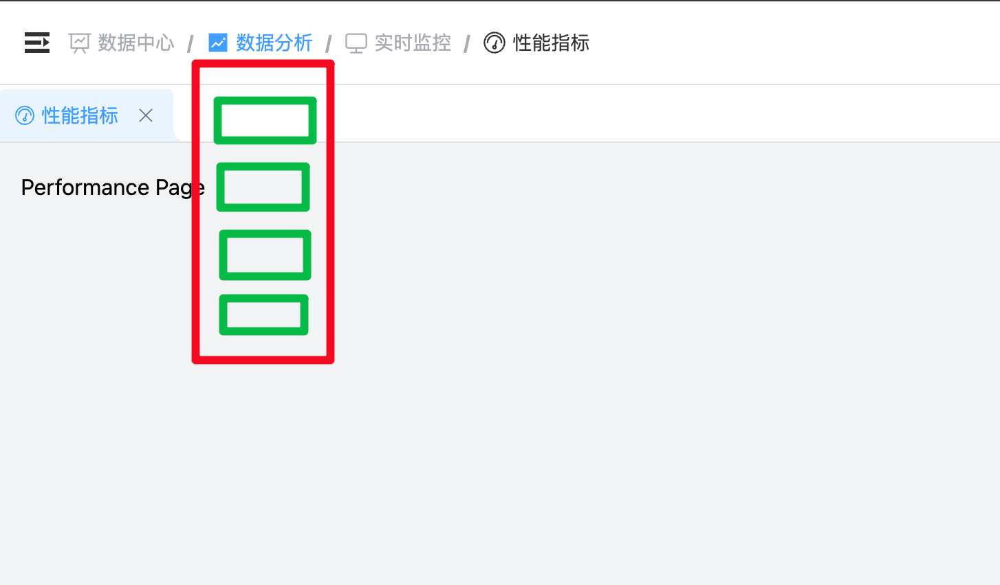

---

经常有一些想法，无法来得及实现。

有些是具体的需求，但是因为实现起来比较复杂、花费时间较长、或者还没有想好如何更好的去组织代码；

有些是比较模糊的创意，暂时没有想法具体该设计成什么样子；

为了督促自己讲这些想法和创意去落实，因此添加本文档，用来随时记录下这些想法和创意，以待后续去实现。

---

- [ ] 面包屑导航，鼠标悬浮在面包屑上，以树形结构显示子菜单

  

- [ ] 右键菜单，鼠标右键点击某个元素时，显示该元素的右键菜单，支持多种形式调用方式
  - [ ] 组件形式调用
      ```vue
      <template>
        <ContextMenu :options="options">
          <template #trigger>
            <div class="target-element">
              右键点击我
            </div>
          </template>
          <!-- 这里还没有想搞如何换设计子容器 -->
          <!-- 会有菜单分组、菜单嵌套、分割线、自定义render 等场景 -->
          <ContextMenuItem label="复制" @click="copy" />
          <ContextMenuItem label="粘贴" @click="paste" />
        </ContextMenu>
      </template>
      ```
  - [ ] 函数形式调用
      ```js
      const options = [
        { label: '复制', onClick: copy },
        { label: '粘贴', onClick: paste },
      ];
      // api 还没有去设计，但是实现的功能应该是和 组件形式是一致的
      ContextMenu(options);
      ```
  - [ ] 指令形式调用 (其实不太想实现执行版本，简单功能还好，复杂一点用指令就太麻烦了)
      ```vue
      <template>
        <div v-context-menu="options">
          右键点击我
        </div>
      </template>
      ```
  - https://docs.imengyu.top/vue3-context-menu-docs/

- [ ] ProForm

  实现类似 Ant Design React 的 ProForm 组件，使用效果也和 Antd ProForm 一直，移除 modelValue 概念。这就意味着需要将所有的表单组件都包装一层（曾经考虑过用适配器的方式实现，从而减少工作量 `<FormFieldAdapter label="用户名" name="username" modelKey="modelValue" :component="Input" />`）

- [ ] 重构 ConfigTable 组件，

  初衷是为了实现表格列动态配置(排序、隐藏等功能)。调研一圈发现，如果想是实现该功能，就要放弃 element-plus table 的模板语法，使用配置 columns 的方式来实现。

- [ ] 结合上面的 ProForm 和 ConfigTable，重构列表页模板(现在查询按钮也没对齐)

- [ ] 登录鉴权，一开始懒，没做
